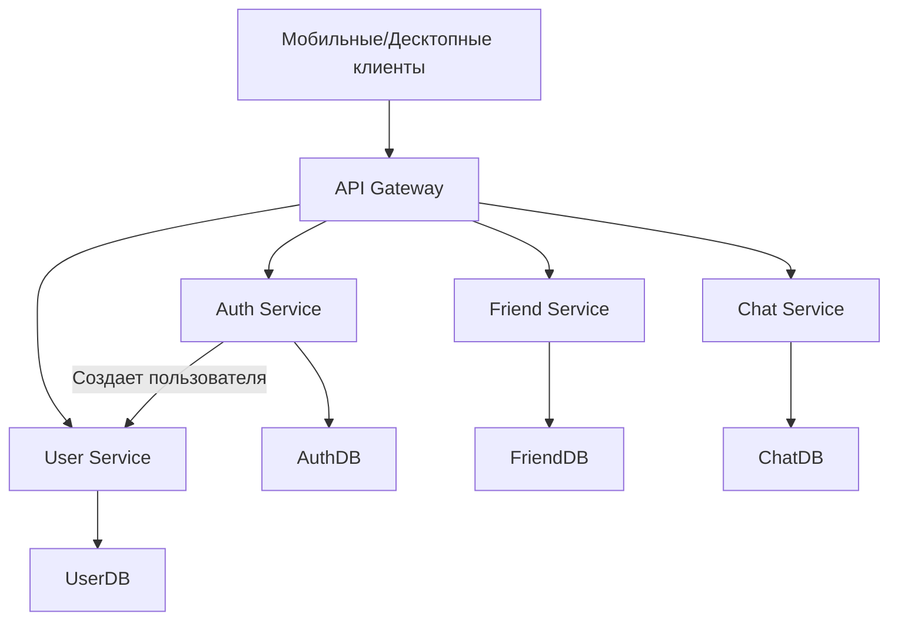

# AUTH Service
## Корневая сущность: сессия
### Ответственность
1) Создание сессий
2) Авторизация / Регистрация пользователей
3) Выдача токенов
4) Рефреш
5) Отзыв токенов
### Данные для хранения
1) Email : хеш пароля
2) Наличие регистрации по email / oauth
### API
1) Register – инициализация регистрации
2) Authorize – инициализация авторизации
### Хранение
1) KeyDB – для хранения имеющихся авторизаций, отзывного листа токенов

## USER Service
## Корневая сущность : пользователь
### Ответственность
1) Хранение данных пользователя
2) Редактирование пользователя
3) Поиск информации о пользователе
### Данные для хранения
1) Модель пользователя
### API
1) SearchUser – поиск по никнейму
2) EditInfo – изменения информации
3) ChangePhoto – изменение фото
4) CreateUser – создание пользователя
### Хранение
1) S3 – для изображений
2) Postgresql – для информации о пользователе
3) ElasticSearch – для поиска информации о пользователе (превью выдача списка пользователей)

# CHAT Service
## Корневая сущность: чат
### Ответственность
1) Хранение чатов
2) Получение / отправка сообщений
### Данные для хранения
1) История сообщений
2) Списки чатов
### API
1) Send – отправка сообщения
2) Get – получение сообщений
3) GetChats – получение списка имеющихся чатов
### Хранение
1) Cassandra DB – для хранения чатов и быстрой выдачи по периоду времени

# FRIEND Service
## Корневая сущность : связь пользователей
### Ответственность
1) Хранение связей
2) Создание связей
3) Редактирование связей
### Данные для хранения
1) Связи пользователей
2) Хранение не подтвержденных связей
### API
1) Add – добавление в друзья
2) Remove – удаление из друзей
### Хранение
1) Postgresql – для хранения связей

